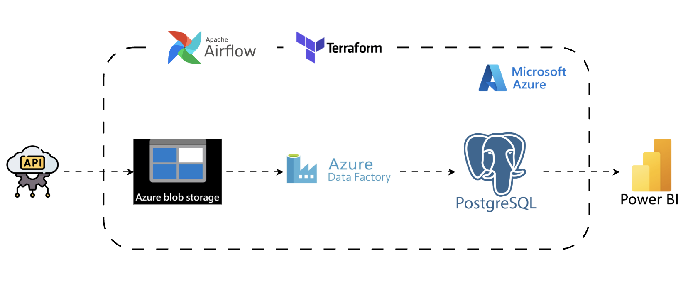

# 311 Service NYC Analytics Pipeline

This repository contains my production-grade prototype on developing a cloud-based data pipeline for easy, fast, and reliable access to the public NYC311 municipal service data. The municipal services in the city can use this to get clean and understandable insights into the citizens' municipal issues (e.g. housing, streets, sidewalks, sanitation, quality of life, etc.). As mentioned before, this repository contains only the beta version of the actual code that will be used by the NYC311 service so as not to publicly disclose confidential company code.

## Key Features

I implemented an ETL pipeline that takes the raw NYC311 service data from an online API and transforms it using Python. An Azure blob storage account is used to store the raw and transformed versions of the data. Then, an Azure data factory pipeline loads the transformed data into an Azure PostgreSQL flexible server. From then on, the data can be queried for analytics.   

The tech stack includes:
- Python: used for the extraction and transformation layers of the pipeline, as well as Airflow configuration
- Azure: cloud storage, data factory pipeline, and PostgreSQL flexible server
- Airflow (Astro CLI): manages the scheduling, running, and monitoring of the entire pipeline code programmatically
- Terraform: manages the entire Azure infrastructure programmatically
- Docker: Astro CLI runs Airflow on local Docker containers

